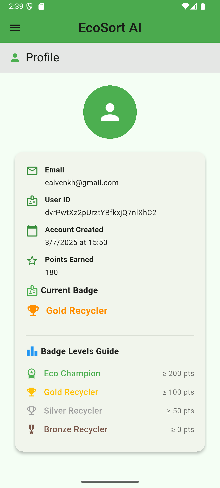
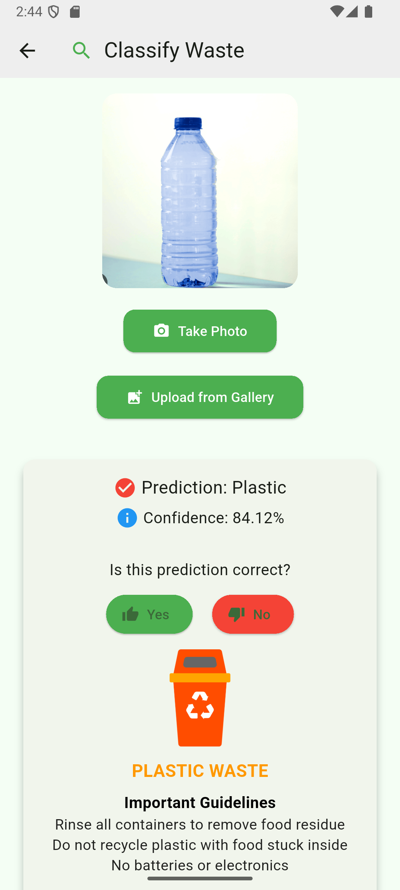
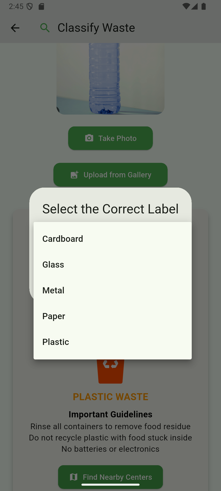
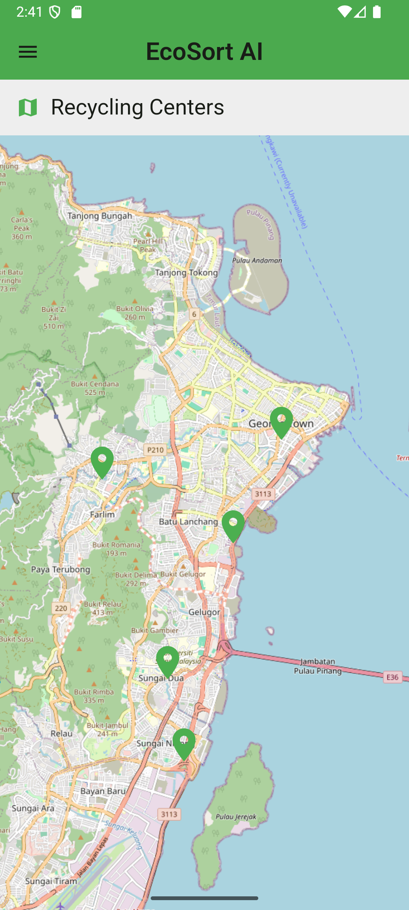

# ♻️ EcoSort AI

EcoSort AI is a Flutter-based mobile application that uses AI to help users identify and classify waste types for proper recycling. It leverages a Flask-based image classification model and integrates with Firebase for feedback correction, reward redemption, and dynamic recycling guides.

---

## 📱 Features

- 📷 Snap or upload an image for waste classification  
- 🧠 AI prediction with confidence score  
- 📋 Dynamic recycling tips loaded from Firestore  
- 👍 User feedback: Accept or correct predictions  
- 📤 Upload incorrect images to GitHub via Firebase Functions  
- 🔁 Detect and prevent duplicate image submissions using SHA256 hashing  
- 🎁 Points and rewards system: Redeem vouchers with earned points  
- 🔐 Firebase login/register authentication  
- 📍 Interactive map of recycling centers  
- 📘 Educational expandable section: *Why Recycle?*    

---

## 🧠 AI Integration

The app sends images to a **Flask backend model** via HTTP:

```bash
POST http://192.168.0.135:5000/predict (refer to own server ip)
```

Returns:
```json
{
  "prediction": "Plastic",
  "confidence": "87.25%"
}
```

---

## 🔥 Firebase Firestore Structure

### Collection: `recycling_guide`
Each document represents a material type.

| Field       | Type     | Example                         |
|-------------|----------|---------------------------------|
| `name`      | String   | "Plastic"                       |
| `tip`       | String   | "Rinse and recycle in Blue Bin" |

### Collection: `corrections`
Stores user corrections.

| Field       | Type      | Example                              |
|-------------|-----------|--------------------------------------|
| `label`     | String    | "Glass"                              |
| `path`      | String    | "corrections/glass_12345678.png"     |
| `timestamp` | Timestamp | Server timestamp                     |

### Collection: `users`
Stores user earned point.

| Field       | Type      | Example                              |
|-------------|-----------|--------------------------------------|
| `points`    | Number    | 50                                   |

### Collection: `history`
Stores user feeback/upload image.

| Field       | Type      | Example                              |
|-------------|-----------|--------------------------------------|
| `hash`      | String    | (SHA256 image hash)                  |
| `label`     | String    | "Plastic"                            |
| `timestamp` | Timestamp | Server timestamp                     |

### Collection: `vouchers`
Stores voucher info

| Field       | Type      | Example                              |
|-------------|-----------|--------------------------------------|
| `cost`      | Number    | 50                                   |
| `description`| String   | "Get RM5 off your next coffee"       |
| `name`      | Timestamp | "Starbucks RM5"                      |

---

## 🗂️ Dataset Sources

The AI model was trained using publicly available waste classification datasets:

- [RealWaste Dataset – by joebeachcapital on Kaggle](https://www.kaggle.com/datasets/joebeachcapital/realwaste)  
- [Garbage Classification Dataset – by asdasdasasdas on Kaggle](https://www.kaggle.com/datasets/asdasdasasdas/garbage-classification)

These datasets contain labeled images of waste items including plastic, metal, cardboard, glass, and more. They served as the foundation for training the ResNet-based image classifier used in EcoSort AI.

---

## 📷 Screenshots

| Register | Login | Home | Profile | Classify Waste | Feedback | Recycling Guide | Recycling Centers | Voucher Redeem |
|----------|-------|------|---------|----------------|----------|-----------------|-------------------|----------------|
|  |  |  |  |  |  |  |  | 

---

## 📁 Folder Structure

```
lib/
├── Module/
│   ├── Home.dart
│   ├── Waste.dart
│   ├── Guide.dart
│   ├── Login.dart
|   ├── RedeemVoucher.dart
│   ├── Register.dart
│   └── ProfilePage.dart
├── config/
│   ├── Map.dart
│   ├── Correction.dart
│   ├── Feedback.dart
│   ├── ImgDetector.dart
│   ├── WidgetTree.dart
│   └── Notifier.dart
└── main.dart
```

---

## 🚀 Installation

### 1. Clone the repo

```bash
git clone https://github.com/Calvenn/eco_sort_ai.git
cd eco_sort_ai
```

### 2. Install Flutter dependencies

```bash
flutter pub get
```

### 3. Firebase setup

- Create a Firebase project at https://console.firebase.google.com  
- Enable Firestore  
- Add your `google-services.json` or `firebase_options.dart` (via FlutterFire CLI)

### 4. Run the app

```bash
flutter run
```

---

## 🛠️ Flask Server Setup (for AI)

> Optional – if you're testing the AI model locally.

---

## 🔒 Duplicate Image Detection

To prevent users from cheating by uploading the same image repeatedly

- 🧮 Each image is hashed using SHA256
- 🔍 Before prediction, the app checks Firestore to see if the same hash was already uploaded
- ❌ If a match is found, the app blocks the prediction and notifies the user

## 🧾 Reward Redemption

- 🪙 Users earn 10 points for accepting predictions
- 🖊️ Earn 15 points for submitting a correction
- 🎁 Points can be used in the Redeem Page to claim vouchers
- 🔐 Redemption history is stored in users/{uid}/redeemed

## 👤 Credits

- UI/UX by Calven  
- AI Model: Waste Classification using ResNet18  
- Maps: OpenStreetMap  
- Backend: Flask + Firebase  

---

