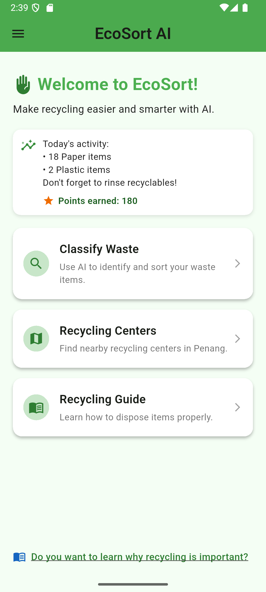
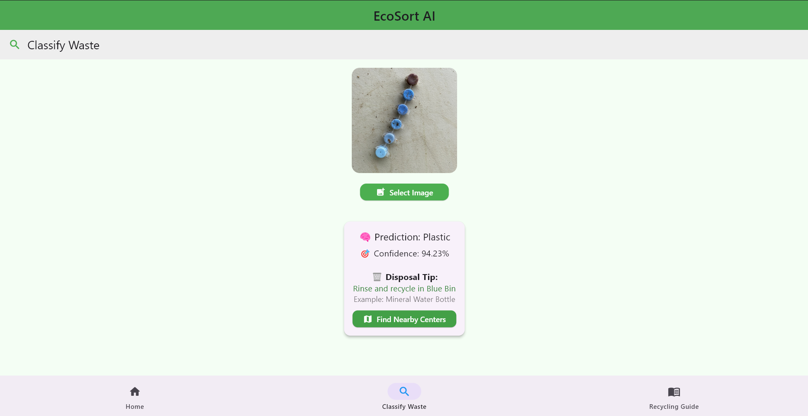
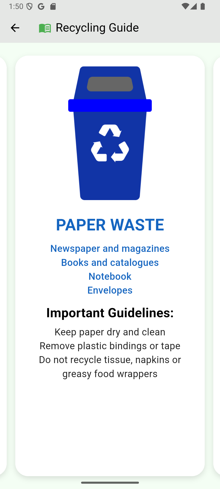

# ♻️ EcoSort AI

EcoSort AI is a Flutter-based mobile application that uses AI to help users identify and classify waste types for proper recycling. It leverages a Flask-based image classification model and integrates with Firebase for feedback correction and recycling guides.

---

## 📱 Features

- 📷 Image classification of waste using AI
- 🎯 Displays confidence score and disposal tips
- 👍 User feedback & correction collection
- 🔁 Dynamic recycling guide (loaded from Firebase)
- 📍 Interactive map of Penang recycling centers

---

## 🧠 AI Integration

The app sends images to a **Flask backend model** via HTTP:

```bash
POST http://127.0.0.1:5000/predict
```

Returns:
```json
{
  "prediction": "Plastic",
  "confidence": "87.25%"
}
```

---

## 🔥 Firebase Firestore Structure

### Collection: `recycling_guide`
Each document represents a material type.

| Field       | Type   | Example                        |
|-------------|--------|--------------------------------|
| `name`      | String | "Plastic"                      |
| `tip`       | String | "Rinse and recycle in Blue Bin"|

### Collection: `corrections`
Stores user corrections.

| Field     | Type   | Example                                |
|-----------|--------|----------------------------------------|
| `label`   | String | "Glass"                                |
| `path`    | String | "corrections/glass_12345678.png"       |
| `timestamp`| Timestamp | Server timestamp                 |

---

## 📷 Screenshots

> *(Add actual screenshots of your app below)*

| Home | Classify Waste | Recycling Guide |
|------|----------------|-----------------|
|  |  |  |

---

## 📁 Folder Structure

```
lib/
├── Module/
│   ├── Home.dart
│   ├── Waste.dart
│   └── Guide.dart
├── config/
│   ├── Map.dart
│   ├── Correction.dart
│   ├── Feedback.dart
│   ├── NavBar.dart
│   ├── WidgetTree.dart
│   └── Notifier.dart
└── main.dart
```

---

## 🚀 Installation

### 1. Clone the repo

```bash
git clone https://github.com/yourusername/eco_sort_ai.git
cd eco_sort_ai
```

### 2. Install Flutter dependencies

```bash
flutter pub get
```

### 3. Firebase setup

- Create a Firebase project at https://console.firebase.google.com
- Enable Firestore
- Add your `google-services.json` / `firebase_options.dart` if using FlutterFire CLI

### 4. Run the app

```bash
flutter run
```

---

## 🛠️ Flask Server Setup (for AI)

> Optional – if you're testing the AI model locally.

```bash
cd server
pip install -r requirements.txt
python app.py
```

---

## 🧑‍💻 Credits

- UI/UX by Calven
- AI Model: AI Waste Classification by Calven
- Maps: OpenStreetMap
- Backend: Flask + Firebase

---

## 📄 License


